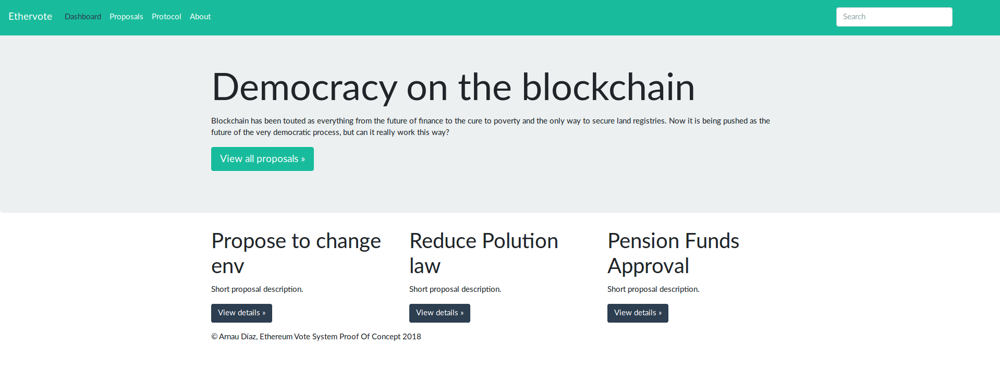
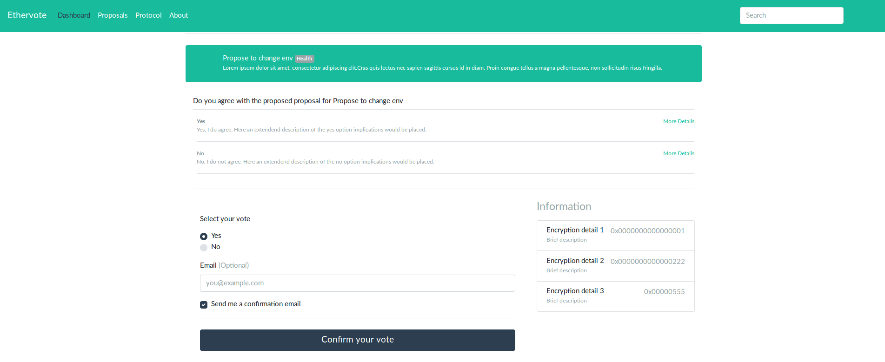
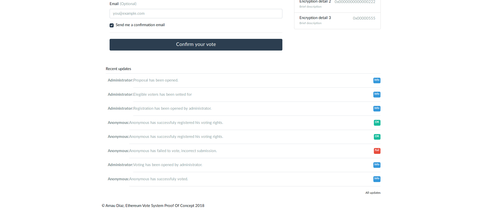

# Ethereum-Votimg






Descentralized voting application, DAPP, using ethereum.
## Table of content

- [Getting Started](#getting-started)
    - [Built With](#built-with)
    - [Prerequisites](#built-with)
    - [installing](#installing)
    - [For OSX and Linux](#for-osx-and-linux)
    - [Testing](#running-the-tests)
- [Run Dapp](#run-dapp)
    - [Loval Development with Truffle](#run-dapp)
    - [Local Development with TestRPC](#local-development-with-testrpc)
    - [Deployment in testnet or mainnet](#deployment)
- [Contributing](cContributing)
- [Credits](#credits)
- [License](#license)


# Getting Started

<These instructions will get you a copy of the project up and running on your local machine for development and testing purposes. See deployment for notes on how to deploy the project on a live system.>

## Built With

<Frameworks used>
  
* [Angular5](https://angular.io/) - The web framework used
* [Web3j](https://github.com/web3j/web3j) - Integration with Ethereum client
* [Truffle](http://truffleframework.com/) - The most popular development framework for Ethereum
* [Bootstrap](https://getbootstrap.com/) - Bootstrap is an open source toolkit for developing with HTML, CSS, and JS.

## Prerequisites

<What things you need to install the software and how to install them>

Check first for at least node 9.2.0, npm 5.5.1:
```
nodejs -v
npm -v
```
npm is bundled with Node.js, so to install npm you only need to install Node.js on your Ubuntu/Debian
```
curl -sL https://deb.nodesource.com/setup_9.x | sudo -E bash -
sudo apt-get install -y nodejs
```
## Installing

1. Fork this repo by clicking **Fork** button in top-right corner of this web page. Continue to follow instruction steps from your own ethereum-voting repo.
2. Clone your own "ethereum-voting" repo. Copy the link from the "Clone or download" button near the top right of this repo's home page.
3. The rest of these steps must be done from your machine's command line. See the [Run Dapp](#run-dapp) or [Deployment](#deployment) section to continue if you already have the repository installed.

## For OSX and Linux

1. From the desired directory you wish to copy the "ethereum-voting" folder with source files to.
    ```
    git clone {paste your own repo link here}
    ```
    NOTE: Please use `develop` branch for contributing.
    ```
    git clone -b develop {paste your own repo link here}
    ```
2. Change directories to proposal-scheme:
    ```
    cd ethereum-voting
    ```
3. Make sure you have the [pre-requisites](#Prerequisites) [NodeJS](https://nodejs.org/) (v8.4.0 or higher) and [npm](https://www.npmjs.com/) (5.4.1 or higher) installed.

4. Install dependencies from within proposal-scheme directory:
    ```
    npm install
    ```
5. That is it, you are now ready to run the proposal-scheme dapp! Head to the [Run dapp](#run-dapp) section for further instructions.


# Run Dapp

For local node using truffle follow these steps.

```
truffle develop
```
Inside the truffle console write,
```
compile
migrate
```
Run the webpack server for front-end hot reloading (outside the development console). Smart contract changes must be manually recompiled and migrated.

 Serves the scheme front-end on http://localhost:4200
 ```
 npm start
```

If port already in use error run
```
sudo lsof -t -i tcp:4200 | xargs kill -9
```

## Running the tests

TODO: Add testing coverage

```
truffle test
```

## Local Development with TestRPC

Change your environment variable in truffle.js to your desired host and port.

```typescript
  networks: {
    development: {
      host: 'localhost',
      port: 8545,
      network_id: '*' // Match any network id
    }
```
In a new terminal execute testrpc
```
testrpc
```
Recompile and migrate your truffle contracts to this development node
```
truffle compile
```
```
truffle migrate
```
Start your client.

## Deployment

You can deploy in infura or other alternatives following their instructions.


# Credits

Arnau Díaz. diazarnau@gmail.com 

# License

MIT
